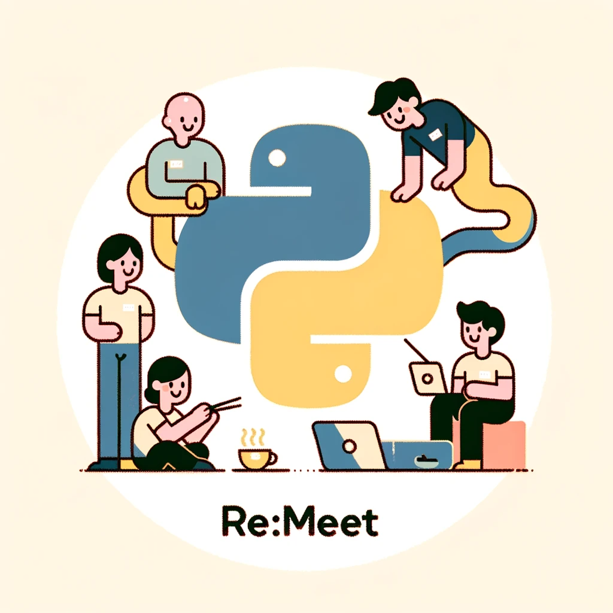
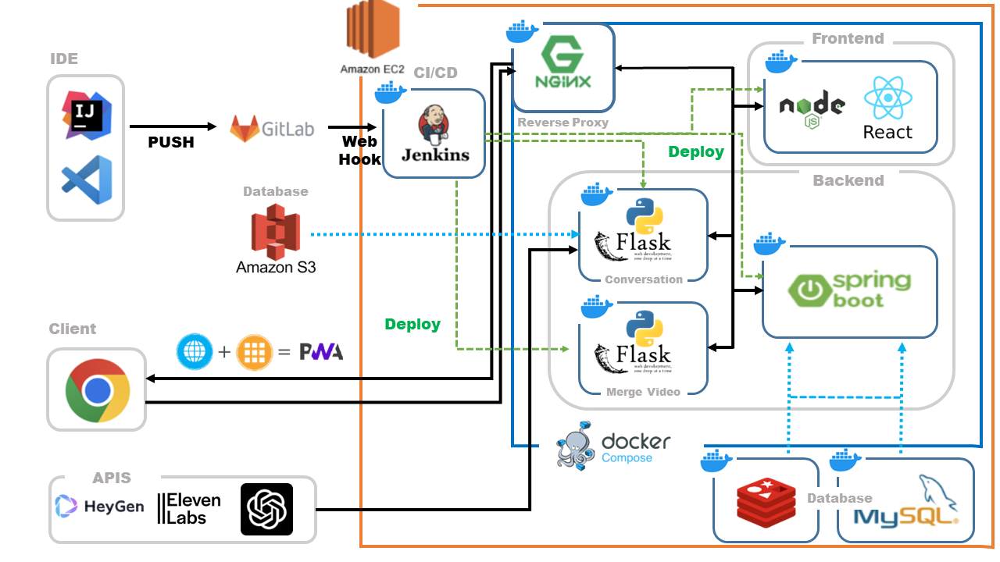
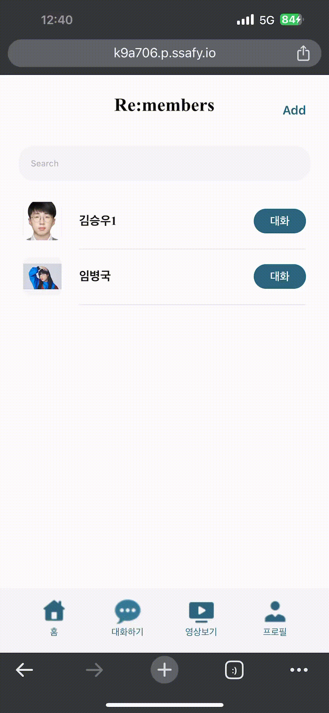
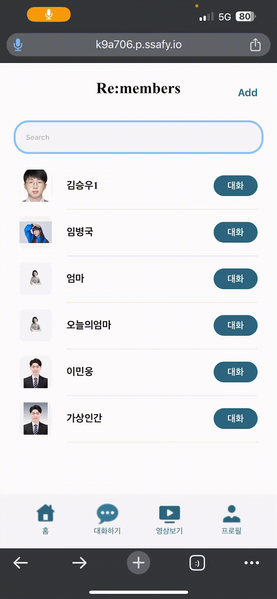
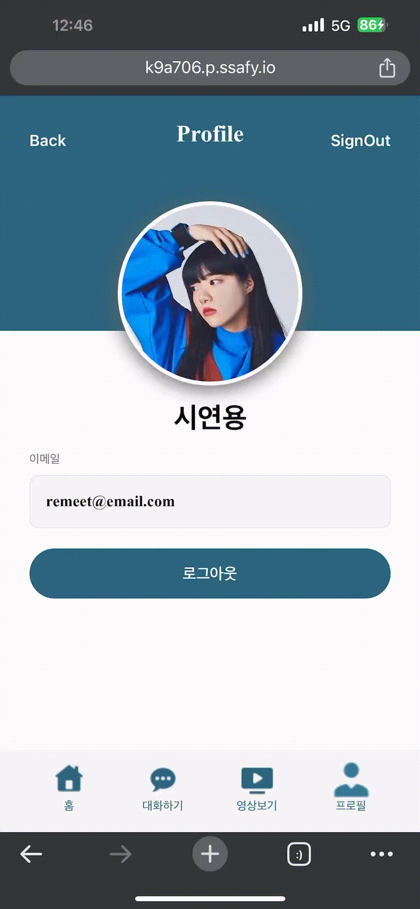

# RE:MEET (SSAFY 9기 자율프로젝트)

# A706 (팀명)



## **0️⃣프로젝트 개요**

🔵 프로젝트명 : **Re:Meet**🔵

🔹 프로젝트 컨셉 : 소중한 사람을 기록하고 다시 만나는 디지털 트윈

🛠 개발 기간 : 23.10.10 ~ 23.11.20 (6주)

🧑🏻 팀원 : 이승준, 김영우, 김승우, 황상미, 임병국, 이민웅

💻 사용 기술스택 : Java(SpringBoot), Python(Flask), React(TypeScript), AWS + (4. 시스템 아키텍처 참고)


## **1️⃣ 서비스 주요기능**

- STT(React-speech-recognition) : 사용자의 음성을 인식하고 대화를 텍스트로 변환합니다.
- LLM(ChatGpt) : ChatGPT를 활용하여 대화 프롬프트를 만들고 대화 응답을 만들어냅니다.
- TTS(ElevenLabs) : 사용자의 음성을 학습하여 목소리 모델을 만들고 응답 음성을 생성합니다.
- Face Generate AI(Heygen): 이미지를 기반으로 응답음성을 발화하는 얼굴영상을 생성합니다.

## **2️⃣ 서비스 세부 기능**


| 기능                   | 주기능                    | 상세 기능                              |
| ---------------------- | ------------------------- | -------------------------------------- |
| 1.User               | 1.1 회원가입            | 사용자의 회원가입을 진햅합니다      |
|                        | 1.2 아이디 중복확인        | 아이디의 중복 여부를 체크합니다.         |
|                        | 1.3 회원 탈퇴        | 사용자의 회원탈퇴를 진햅합니다                   |
|                        | 1.4 로그인        | 사용자의 로그인을 진행합니다.                 |
|                        | 1.5 로그아웃        | 사용자의 토큰을 만료시킵니다.                  |
|                        | 1.6 개인정보조회        | 사용자 정보를 제공합니다.                 |
|                        | 1.7 토큰 재발급        | ACCESS TOKEN 이 만료된 경우 헤더에 REFRESH TOKEN 을 넣어서 재발급 받습니다                   |
| 2.ModelList               | 2-1. 대화 상대 전체 조회            | 사용자의 회원가입을 진햅합니다      |
|                        | 2-2. 대화 상대 상세 조회       | 아이디의 중복 여부를 체크합니다.         |
|                        | 2-3. 대화 상대 삭제        | 사용자의 회원탈퇴를 진햅합니다                   |
| 3.Modeling               | 3-1. 대화 상대 추가 조회            | 사용자의 회원가입을 진햅합니다      |
|                        | 3-2. 대화 모델 학습음성 조회 조회       | 아이디의 중복 여부를 체크합니다.         |
|                        | 3-3. 대화 모델 영상 조회        | 사용자의 회원탈퇴를 진햅합니다                   |
|                        | 3-4. 보이스모델 생성 조회        | 사용자의 회원탈퇴를 진햅합니다                   |
|                        | 3-5. heygen id 대상 조회 조회        | 사용자의 회원탈퇴를 진햅합니다                   |
|                        | 3-6. heygen id 생성 조회        | 사용자의 회원탈퇴를 진햅합니다                   |
|                        | 3-7. 기본,링싱크 영상생성 조회        | 사용자의 회원탈퇴를 진햅합니다                   |
| 4.Board               | 4-1. 최근 대화 영상 조회 조회            | 사용자의 회원가입을 진햅합니다      |
|                        | 4-2. 특정 인물과 대화 영상 전체 조회 조회       | 아이디의 중복 여부를 체크합니다.         |
|                        | 4-3. 대화 영상 삭제 조회        | 사용자의 회원탈퇴를 진햅합니다                   |
| 5.Conversation               | 5-1.  대화생성 조회            | 사용자의 회원가입을 진햅합니다      |
|                        | 5-2. STT(귀)      | 아이디의 중복 여부를 체크합니다.         |
|                        | 5-2-1. 질문 업로드       | 사용자의 회원탈퇴를 진햅합니다                   |
|                        | 5-3. 음성 대화하기       | 사용자의 회원탈퇴를 진햅합니다                   |
|                        | 5-4. 비디오로 대화하기       | 사용자의 회원탈퇴를 진햅합니다                   |
|                        | 5-5. 대화 저장       | 사용자의 회원탈퇴를 진햅합니다                   |


## 3️⃣ 컴포넌트 구조

## 4️⃣ 시스템 아키텍처 및 DB 모델링(ERD)

<h3>System Architecture</h3>




<h3>ERD</h3>


## 5️⃣ Convention

<details>
<summary>컨벤션 접기/펼치기</summary>

## ✔️ Branch Convention

- 브랜치 생성시 다음과 같은 방식으로 브랜치 목적에 맞는 브랜치 헤더를 설정한다.

| 생성 목적 | 브랜치 위치         |
| --------- | ------------------- |
| 기능 개발 | Feat {issue_number} |
| 버그 픽스 | Fix {issue_number}  |
| 예제      | Feat 188            |

```
issue_number: 해당 이슈가 진행되는 스프린트에서 할당받은 고유 이슈 번호
```

- 체계적인 분류를 위해 브랜치 이름을 통해 의도를 명확하게 드러낸다.

- 새로운 브랜치는 항상 최신의 develop 브랜치에서 만든다.

- develop 브랜치는 항상 최신의 상태로 유지한다.

### Git branch 사용법

- 현재 branch 확인<br/>
  `git branch`
- 새로운 branch 생성하기<br/>
  `git branch 브랜치명`
- branch 이동하기<br/>
  `git switch 브랜치명`
- branch를 생성하면서 이동하기<br/>
  `git switch -c 브랜치명`
- 변경사항 복원하기<br/>
  `git restore 파일명`
- branch 삭제하기<br/>
  `git branch -d 브랜치명`
- branch push하기<br/>
  `git push -u origin 브랜치명` (원격 레포지토리에 브랜치가 없을 때)<br/>
  `git push`


---

<br/>
<br/>

## ✔️ Commit Convention

### 1. Commit Message Structure

|   개요    |             설명             |
| :-------: | :--------------------------: |
| 작성 방법 | **`깃모지_내용_(이슈번호)`** |
|   예제    | :art:\_코드 수정\_([#234]()) |
|   코드    | **`:art:_코드 수정_(#234)`** |

### 2. Commit Type : 깃모지

- 필요 기능 발견 시 담당자에게 건의
- [참고](https://gitmoji.dev/) : IntelliJ, VSCode에서도 연동 가능

| 아이콘 |     코드     |           설명           |                  원문                   |
| :----: | :----------: | :----------------------: | :-------------------------------------: |
|   🎨   |   `:art:`    |  코드의 구조/형태 개선   | Improve structure / format of the code. |
|   🔥   |   `:fire:`   |      코드/파일 삭제      |          Remove code or files.          |
|   🐛   |   `:bug:`    |      **버그 수정**       |               Fix a bug.                |
|   ✨   | `:sparkles:` |       **새 기능**        |         Introduce new features.         |
|   📝   |   `:memo:`   |      문서 추가/수정      |      Add or update documentation.       |
|   💄   | `:lipstick:` | UI/스타일 파일 추가/수정 |  Add or update the UI and style files.  |

### 3. Commit Type : 내용

- 선택사항
- **`어떻게`** 보다는 **`'무엇을'`, `'왜'`** 변경했는 지에 대해 작성
- 72자를 넘기지 말기

### 4. Commit Type : 이슈번호

- 선택사항
- **`Issue Tracker ID`** 를 작성
- 여러 개의 이슈번호는 **`,`** 로 구분

<br/>
<br/>

## ✔️ Merge Convention

** MR(Merge Request) 생성**

- 피드백이나 도움이 필요할 때 그리고 merge 준비가 완료되었을 때 Merge Request를 생성한다.

- 동료들의 리뷰가 끝난 후 준비가 완료되었다면 develop 브랜치(or develop-(FE/BE))로 반영을 요구한다

- develop 브랜치로 merge될 경우 conflict를 작업 중인 브랜치에서 미리 해결하고 진행한다.

- MR 생성 시 예시

    - MR 제목

  | 생성 목적 | MR 제목                              |
    | --------- | ------------------------------------ |
  | 기능 개발 | [issue_number] issue_name            |
  | 버그 픽스 | [issue_number] issue_name (Fix)      |
  | 코드 개선 | [issue_number] issue_name (Refactor) |

    - 예시

  ```
  | 기능 개발 | [#22] 로그인기능 구현  |
  | 버그 픽스 | [#22] 로그인기능 구현 (Fix)  |
  | 코드 개선 | [#22] 로그인기능 구현 (Refactor)|
  ```

    - MR 설명

  ```
  - Merge Request 이유:
   - feature 병합 / 버그수정 / 코드 개선 등
  - 세부내용:
    - 왜 해당 MR이 필요한지 최대한 다른 사람이 알아볼 수 있도록 적기
  - Relevant issue number:
    - 관련된 이슈 넘버가 있으면 이곳에 기입해주세요, ex) #000, #000
  ```

<br>

### 0. 코드 리뷰할 때 주의사항

- **nit 줄이기** : 사소하고 작은 문제로 주로 스타일 가이드 준수, 가독성 개선 등을 의미 / 전체적으로는 중요하지 않지만 품질 향상에 도움이 될 수 있는 부분에서 사용
- **변경 사이즈 줄이기** : 리뷰할 내용이 커지면 코드 리뷰하기 부담

### 1. 코드 리뷰 방식

|  타입  | 개요                                                                  | 설명                                                                                                     |
| :----: | --------------------------------------------------------------------- | -------------------------------------------------------------------------------------------------------- |
| **P1** | 이번에 반드시 반영되어야 하는 중대한 코드 수정 의견 (Request Changes) | 버그 가능성이 있거나 잘못된 구현인 경우. 만약 반영되지 않는다면 이에 대한 반대 의견도 낼 수 있어야 한다. |
| **P2** | 적극적으로 이야기했으면 하는 의견 (Request Changes)                   | 잠재적인 이슈나 확장성을 고려해야 하는 경우. 토론하며 의견 조율할 수 있다.                               |
| **P3** | 가능하다면 반영해주었으면 하는 의견 (Comment)                         | 지금 구현보다 더 나은 방향이 있는 경우. 이번 반영이 어렵다면 다음 작업에서도 고려해볼 수 있도록 한다.    |
| **P4** | 다음에 반영 되도 되는 의견 (Approve)                                  | 반영이 되지 않거나 반대 의견을 적극적으로 할 필요 없다.                                                  |
| **P5** | 사소한 의견 (Approve)                                                 | 무시해도 됨. 혹은 관련 나누고 싶은 점 나눌 수 있다.                                                      |

</details>


## **6️⃣ 서비스 화면**

<details>
<summary>서비스 접기/펼치기</summary>
<h2>회원가입 및 로그인</h2>

- 회원가입


- 로그인


<h2>마이페이지</h2>

- 프로필 및 로그아웃



<h2>모델</h2>

- 모델 생성


- 모델 삭제



- 모델 검색



- 모델 확인


<h2>대화</h2>

- 음성 대화


- 영상 대화


- 대화 저장


</details>

## **7️⃣ 프로젝트 회고**
| 이름   | 내용                                                         |
| ------ | ------------------------------------------------------------ |
| 이승준 | Springboot를 활용한 백엔드 설계 경험과 Infra 개념을 이해하고 Jenkins, Docker를 활용하여 CI/CD 구축을 경험해본점이 좋았다. 기능과 API를 명세서를 기준으로 문서화하여 관리한 부분이 잘 되었다고 생각하지만, ERD 설계에 있어서 DB 를 설계단계에서 고안했던 부분과 실제로 구현할 때, 데이터 타입과 field들에서 수정할 부분이 많이 생겼었다. 다음 프로젝트에서는 인증/인가 부분을 깊게 이해하고, Infra를 좀 더 효율적으로 설계해보고 싶다는 아쉬움이 남았다. |
| 김영우 | JPA를 활용한 백엔드 개발을 경험할 수 있는 기회였다. 이전 프로젝트와 유사한 기능을 다른 방식으로 구현해보며 백엔드와 프론트엔드의 협업의 중요성을 또다시 느낄 수 있는 값진 경험이었다고 생각한다. 무엇보다 적극적으로 의견을 제시하고 형상 관리 프로그램(Git, Jira, Notion)을 잘 활용해준 팀원분들께 감사하다. 다만 코드 리뷰, 리팩토링 과정을 많이 가지지 못한 점과 redis와 같은 기술을 적용해보지 못했다는 점에서는 아쉬움이 많이 남는다. |
| 김승우 | Java Springboot를 활용하여 Controller, DTO, Service를 구축하여 푸시알림 기능을 구현하였다. 사용자가 버튼을 클릭했을 때, 다른 사용자에게 알림을 보내는 기능을 구현했으나, Cron을 활용하여 정해진 시간에 알림을 보내는 기능을 구현하지 못해 아쉬움이 남는다. 코인 시세 데이터를 시각화하여 차트 UI/UX 디자인을 설계했고, 적극적인 팀원들 덕에 전체 기능들을 완성할 수 있었던 것 같다. 다음에는 기능 구현이 완료되면 팀원이 구현한 코드의 리뷰, 리팩토링 과정에 시간을 할애하고 싶다. |
| 황상미 | 우선 불협화음없이 좋은 팀워크로 성공적인 프로젝트를 할 수 있게 해준 조원들에게 너무나 감사하고, 편안한 분위기에서 재밌게 마무리할 수 있어서 너무나 좋았다. 하지만, 발표 하루 전 제약 조건 설정을 건드리다가 큰 오류가 발생해 구현됐던 기능들이 제대로 작동하지 않아서 큰 문제가 발생했던 것에 대해 팀원들에게 너무 죄송했다. 기술적으로는 백엔드 개발자로서 크게 발전된 것이 없었던 것 같아서 아쉬움이 많이 남는다. 자율 프로젝트 때는 스스로 기술 스택을 향상시키도록 할 것이다. |
| 임병국 | 공통때와 다르게 NGINX를 설정하면서 CLI 환경에 익숙해지고 REST API를 설계 개발 하면서 SPRING과 JPA를 더욱 깊이 있게 학습 하게 되었다. 다음에는 기능 구현이 완료되면 팀원이 구현한 코드의 리뷰, 리팩토링 과정에 시간을 할애하고 싶다. |
| 이민웅 | Backend와 Frontend를 모두 경험해볼 수 있었던 좋은 기회였습니다. ERD 설계부터 UX/UI 디자인에까지 이르는 서비스 개발의 전과정에 참여함으로써 웹 서비스 개발 흐름을 이해할 수 있었고 좋은 팀원들을 만나 해당 과정에서 함께 학습하고 고민하며 성장할 수 있는 값진 경험을 쌓을 수 있었습니다. 앱 출시를 목표로 MoZey 서비스를 더욱 발전시킬 수 있는 기회가 있길 바랍니다. |
